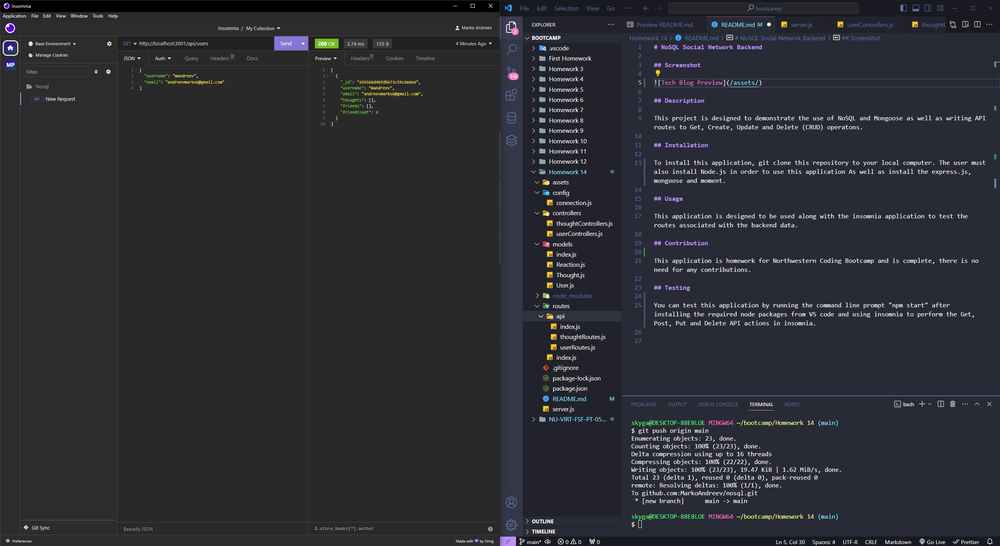

# NoSQL Social Network Backend

## Screenshot

## Description

This project is designed to demonstrate the use of NoSQL and Mongoose as well as writing API routes to Get, Create, Update and Delete (CRUD) operatons.

## Installation 

To install this application, git clone this repository to your local computer. The user must also install Node.js in order to use this application As well as install the express.js, mongoose and moment.

## Usage

This application is designed to be used along with the insomnia application to test the routes associated with the backend data. 

## Contribution

This application is homework for Northwestern Coding Bootcamp and is complete, there is no need for any contributions.

## Testing

You can test this application by running the command line prompt "npm start" after installing the required node packages from VS code and using insomnia to perform the Get, Post, Put and Delete API actions in insomnia.

